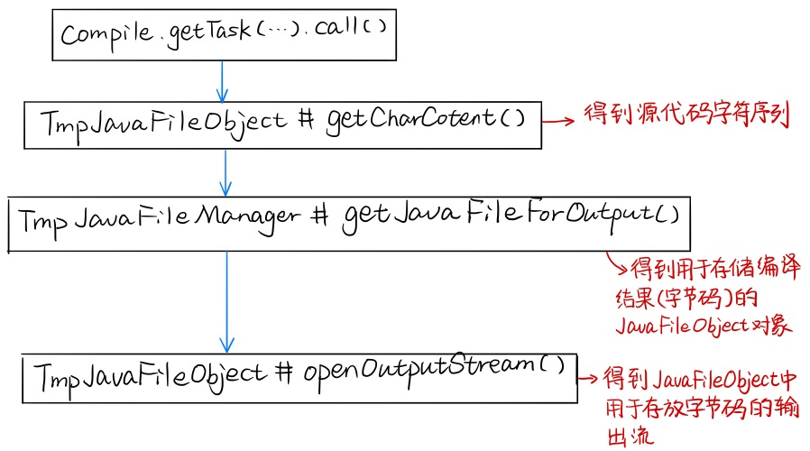

# 动态编译

<!-- TOC -->

- [动态编译](#%E5%8A%A8%E6%80%81%E7%BC%96%E8%AF%91)
  - [准备编译器](#%E5%87%86%E5%A4%87%E7%BC%96%E8%AF%91%E5%99%A8)
    - [`Iterable<? extends JavaFileObject> compilationUnits`](#iterable-extends-javafileobject-compilationunits)
    - [`JavaFileManager fileManager`](#javafilemanager-filemanager)
    - [`DiagnosticListener<? super JavaFileObject> diagnosticListener`](#diagnosticlistener-super-javafileobject-diagnosticlistener)
    - [`Iterable<String> options`](#iterablestring-options)
    - [`Writer out` & `Iterable<String> classes`](#writer-out--iterablestring-classes)
  - [实现编译器](#%E5%AE%9E%E7%8E%B0%E7%BC%96%E8%AF%91%E5%99%A8)

<!-- /TOC -->

从 JDK 1.6 开始，引入了 Java 代码重写的编译接口，使得我们可以在运行时编译 Java 代码，然后在通过类加载器将编译好的类加载进 JVM，这种在运行时编译代码的操作就叫做动态编译。

通过使用动态编译，可以将源代码的字符串直接编译为字节码，在没有动态编译之前，想要在运行过程中编译 Java 源代码，我们要先将源代码写入一个 .java 文件，通过 javac 编译这个文件，得到 .class 文件，然后将 .class 文件通过 ClassLoader 加载进内存，才能得到 Class 对象。这其中存在两个问题：一是会生成 .java 和 .class 两个文件，运行之后还要把它们删除，以防止污染我们的服务器环境；二是会生成文件也就是说涉及 IO 操作，这个操作比起一切都在内存中运行是十分耗时的。所以我们使用了 Java 的动态编译技术，跳过了这两个文件的生成过程，直接在内存中将源代码字符串编译为字节码的字节数组，这样既不会污染环境，又不会额外的引入 IO 操作，一举两得。


## 准备编译器

```java
JavaCompiler compiler = ToolProvider.getSystemJavaCompiler(); // 获取编译器对象
/* 准备执行编译需要的各种入参 */
Boolean result = compiler.getTask(null, manager, collector, options, 
                                  null, Arrays.asList(javaFileObject)).call(); // 执行编译
```

我们发现执行编译的那个函数有一大堆入参需要提前准备，所以我们需要先来看一下这些入参都是什么，以及该怎么准备，getTask() 方法的声明如下：

```java
JavaCompiler.CompilationTask getTask(Writer out,
                                     JavaFileManager fileManager,
                                     DiagnosticListener<? super JavaFileObject> diagnosticListener,
                                     Iterable<String> options,
                                     Iterable<String> classes,
                                     Iterable<? extends JavaFileObject> compilationUnits)
```

这个方法一共有 6 个入参，它们分别是：

- `out`：编译器的一个额外的输出 Writer，为 null 的话就是 System.err；
- `fileManager`：文件管理器；
- `diagnosticListener`：诊断信息收集器；
- `options`：编译器的配置；
- `classes`：需要被 annotation processing 处理的类的类名；
- `compilationUnits`：要被编译的单元们，就是一堆 JavaFileObject。

为了能成功的进行编译，我们要按照上面的入参需求，一个一个的构建这些参数对象。我们将按照重要程度来一个一个讲解。

> **Notes：** 我们将自己实现的 JavaFileObject 和 JavaFileManager 两个类都实现为了 StringSourceCompiler 的内部类，StringSourceCompiler 中有一个 `private static Map<String, JavaFileObject> fileObjectMap = new ConcurrentHashMap<>()` 属性用来存放编译好的字节码对象。

### `Iterable<? extends JavaFileObject> compilationUnits`

这个参数的重点在 `JavaFileObject` 上，是一个装着许多等着被编译的源代码的集合（这些源代码都被封装在了一个一个 `JavaFileObject` 对象中），Java 类库并没有给我们提供能直接使用的 `JavaFileObject`，所以我们要通过继承 `SimpleJavaFileObject` 来实现我们自己的 `JavaFileObject`。

为了知道我们都需要重写 `SimpleJavaFileObject` 的哪些方法，我们首先需要看一下 `compiler.getTask(...).call()` 的执行流程，看看都需要用到什么方法。 `compiler.getTask(...).call()` 的执行流程如下图所示：



**执行流程说明：**

- 首先，要得到源码才能进行编译，所以会调用 JavaFileObject 的 getCharContent 方法，得到源码的字符序 CharSequence；
- 然后，编译器会对得到的源码进行编译，得到字节码，并且会将得到的字节码封装进一个 JavaFileObject 对象；
- 编译器会把字节码结果存入一个 JavaFileObject 中，这个操作是需要创建一个 JavaFileObject 对象的，可是我们用来真实存储源码和字节码的 JavaFileObject 对象是我们自己写的，那么编译器如何得知它应该把编译生成的字节码放入一个怎样的 JavaFileObject 中呢?
- 这时就要轮到 JavaFileManager 出场了，编译器会调用我们传入的 JavaFileManager fileManager 的 getJavaFileForOutput 方法，这个方法会 new 一个我们写的 TmpJavaFileObject 对象，并把返回给编译器；
- 接下来，编译器会把生成的字节码放在 TmpJavaFileObject 对象中，存放的位置是由我们自己指定的，在 TmpJavaFileObject 中加入一个 ByteArrayOutputStream 属性用于存储字节码，编译器会通过 openOutputStream() 来创建输出流对象，并把这个用来存储字节的容器返回给编译器，让它把编译生成的字节码放进去；
- 最后，我们想要的是 byte[] 字节数组，而非一个输出流，只要再在 TmpJavaFileObject 中加入一个 getCompiledBytes() 方法将 ByteArrayOutputStream 中的内容变成 byte[] 返回即可。

所以，我们实现的 SimpleJavaFileObject 的子类如下：

```java
public static class TmpJavaFileObject extends SimpleJavaFileObject {
    private String source;
    private ByteArrayOutputStream outputStream;

    /**
     * 构造用来存储源代码的JavaFileObject
     * 需要传入源码source，然后调用父类的构造方法创建kind = Kind.SOURCE的JavaFileObject对象
     */
    public TmpJavaFileObject(String name, String source) {
        super(URI.create("String:///" + name + Kind.SOURCE.extension), Kind.SOURCE);
        this.source = source;
    }

    /**
	 * 构造用来存储字节码的JavaFileObject
	 * 需要传入kind，即我们想要构建一个存储什么类型文件的JavaFileObject
	 */
    public TmpJavaFileObject(String name, Kind kind) {
        super(URI.create("String:///" + name + Kind.SOURCE.extension), kind);
        this.source = null;
    }

    @Override
    public CharSequence getCharContent(boolean ignoreEncodingErrors) throws IOException {
        if (source == null) {
            throw new IllegalArgumentException("source == null");
        }
        return source;
    }

    @Override
    public OutputStream openOutputStream() throws IOException {
        outputStream = new ByteArrayOutputStream();
        return outputStream;
    }

    public byte[] getCompiledBytes() {
        return outputStream.toByteArray();
    }
}
```

### `JavaFileManager fileManager`

对于 JavaFileManager，我们需要重写以下 2 个方法：

```java
public static class TmpJavaFileManager extends ForwardingJavaFileManager<JavaFileManager> {
    protected TmpJavaFileManager(JavaFileManager fileManager) {
        super(fileManager);
    }

    @Override
    public JavaFileObject getJavaFileForInput(JavaFileManager.Location location, 
                                              String className, 
                                              JavaFileObject.Kind kind) throws IOException {
        JavaFileObject javaFileObject = fileObjectMap.get(className);
        if (javaFileObject == null) {
            return super.getJavaFileForInput(location, className, kind);
        }
        return javaFileObject;
    }

    @Override
    public JavaFileObject getJavaFileForOutput(JavaFileManager.Location location, 
                                               String className, 
                                               JavaFileObject.Kind kind, 
                                               FileObject sibling) throws IOException {
        JavaFileObject javaFileObject = new TmpJavaFileObject(className, kind);
        fileObjectMap.put(className, javaFileObject);
        return javaFileObject;
    }
}
```

### `DiagnosticListener<? super JavaFileObject> diagnosticListener`

直接 new 一个就可以，主要用来告诉我们编译是成功了还是失败了，以及警告信息之类的。

```java
DiagnosticCollector<JavaFileObject> collector = new DiagnosticCollector<>();
```

### `Iterable<String> options`

这个就是我们在使用 javac 命令时，可以添加的选项，比如编译目标，输出路径，类路径等，不需要的话可以传入 null。

```java
List<String> options = new ArrayList<>();
options.add("-target");
options.add("1.8");
options.add("-d");
options.add("/");
```

### `Writer out` & `Iterable<String> classes`

这两个传入 null 就行。


## 实现编译器

最后，我们的编译器实现如下，通过调用 `StringSourceCompiler.compile(String source)` 就可以得到字符串源代码 source 的编译结果。

```java
public class StringSourceCompiler {
    private static Map<String, JavaFileObject> fileObjectMap = new ConcurrentHashMap<>();

    public static byte[] compile(String source) {
        JavaCompiler compiler = ToolProvider.getSystemJavaCompiler();
        DiagnosticCollector<JavaFileObject> collector = new DiagnosticCollector<>();
        JavaFileManager javaFileManager =
                new TmpJavaFileManager(compiler.getStandardFileManager(collector, null, null));

        // 从源码字符串中匹配类名
        Pattern CLASS_PATTERN = Pattern.compile("class\\s+([$_a-zA-Z][$_a-zA-Z0-9]*)\\s*");
        Matcher matcher = CLASS_PATTERN.matcher(source);
        String className;
        if (matcher.find()) {
            className = matcher.group(1);
        } else {
            throw new IllegalArgumentException("No valid class");
        }

        // 把源码字符串构造成JavaFileObject，供编译使用
        JavaFileObject sourceJavaFileObject = new TmpJavaFileObject(className, source);

        Boolean result = compiler.getTask(null, javaFileManager, collector,
                null, null, Arrays.asList(sourceJavaFileObject)).call();

        JavaFileObject bytesJavaFileObject = fileObjectMap.get(className);
        if (result && bytesJavaFileObject != null) {
            return ((TmpJavaFileObject) bytesJavaFileObject).getCompiledBytes();
        }
        return null;
    }

    /**
     * 管理JavaFileObject对象的工具
     */
    public static class TmpJavaFileManager extends ForwardingJavaFileManager<JavaFileManager> {
		// ...
    }

    /**
     * 用来封装表示源码与字节码的对象
     */
    public static class TmpJavaFileObject extends SimpleJavaFileObject {
		// ...
    }
}
```


# 执行字节码的入口方法

<!-- TOC -->

- [执行字节码的入口方法](#执行字节码的入口方法)
  - [新建类加载器加载类](#新建类加载器加载类)
  - [反射运行 main 方法](#反射运行-main-方法)
  - [限制客户端程序的运行时间](#限制客户端程序的运行时间)

<!-- /TOC -->

获取到需要运行的代码的字节码后，我们接下来需要考虑的是如何通过我们得到的字节码将这个类的 main 方法运行起来，为了方便理解，我们将这个过程进行进一步拆分，分为以下 2 步：

- 类的加载：通过类加载器将字节码加载为 Class 对象；
- 类的运行：通过反射调用 Class 对象的 main 方法。

接下来，我们将对以上两个操作的具体实现细节进行进一步讲解。


## 新建类加载器加载类

首先，我们要注意的是，我们绝不可以通过系统可以提供给我们的应用程序类加载器来加载这个类的，因为这个类加载器是独一份的，如果通过这个类加载器加载了我们的字节码，当客户端对源码进行了修改，再次提交运行时，应用程序类加载器会认为这个类已经加载过了，不会再次加载它，这样除非重启服务器，否则我们永远都无法执行客户端提交来的新代码。

想要客户端提交来的代码可以不修改类名的随便修改，我们需要支持热加载。我们知道，两个类相等需要满足以下 3 个条件：

- 同一个 .class 文件；
- 被同一个虚拟机加载；
- 被同一个类加载器加载；

这 3 条中的前两条都不好破坏，我们只能对第三条加以破坏，即每次都新建一个类加载器加载客户端提交来的字节码。这需要我们实现一个新的类加载器： `HotswapClassLoader` 。

不过这里要注意，只有这个从客户端传来的类需要被多次加载，而这个类调用的其他类库方法之类的我们还是想要按照原有的双亲委派机制加载的，也就是说，只有我们自己调用 HotswapClassLoader 去加载类时，它直接把字节数组变成 Class 对象，当虚拟机调用它时，它还按照以前的规则使用 loadClass 方法加载类。

想要把存储字节码的自己数组装换成 Class 对象，我们需要通过 `protected final Class<?> defineClass(String name, byte[] b, int off, int len)` 来完成，所以我们只要新写一个 loadByte 方法把 defineClass 方法开放出来，我们自己要使用 HotswapClassLoader 加载类时就显式调用 loadByte 方法，**虚拟机使用 HotswapClassLoader 时会去调用 loadClass 方法**。

HotswapClassLoader 具体实现如下：

```java
public class HotSwapClassLoader extends ClassLoader {
    public HotSwapClassLoader() {
        super(HotSwapClassLoader.class.getClassLoader());
    }

    public Class loadByte(byte[] classBytes) {
        return defineClass(null, classBytes, 0, classBytes.length);
    }
}
```

然后使用我们新写的类加载器，我们就可以通过以下两行代码无数次的加载客户端要运行的类了！

```java
HotSwapClassLoader classLoader = new HotSwapClassLoader();
Class clazz = classLoader.loadByte(modifyBytes);
```


## 反射运行 main 方法

将类加载进虚拟机之后，我们就可以通过反射机制来运行该类的 main 方法了。

```java
Method mainMethod = clazz.getMethod("main", new Class[] { String[].class });
mainMethod.invoke(null, new String[] { null });
```


## 限制客户端程序的运行时间

我们并不知道客户端发来的程序的实际运行时间，出于安全的角度考虑，我们需要对其运行时间进行限制。

在 ExecuteStringSourceService 中，我们通过使用 Callable + Future 的方式来限制程序的执行时间，并且对运行过程中可能出现的错误进行 catch，返回给客户端。

```java
ExecutorService pool = Executors.newSingleThreadExecutor();
Callable<String> runTask = new Callable<String>() {
    @Override
    public String call() throws Exception {
        return JavaClassExecutor.execute(classBytes);
    }
};
Future<String> res = pool.submit(runTask);

String runResult;
try {
    runResult = res.get(RUN_TIME_LIMITED, TimeUnit.SECONDS);
} catch (InterruptedException e) {
    runResult = "Program interrupted.";
} catch (ExecutionException e) {
    runResult = e.getCause().getMessage();
} catch (TimeoutException e) {
    runResult = "Time Limit Exceeded.";
} finally {
    pool.shutdown();
}
```

 


# 收集代码执行结果：字节码修改器

<!-- TOC -->

- [收集代码执行结果：字节码修改器](#收集代码执行结果字节码修改器)
  - [将 System 替换为 HackSystem 的思路](#将-system-替换为-hacksystem-的思路)
  - [类文件结构](#类文件结构)
    - [Class 文件的头 8 个字节](#class-文件的头-8-个字节)
    - [常量池](#常量池)
  - [ByteUtils 工具](#byteutils-工具)
  - [实现字节码修改器](#实现字节码修改器)

<!-- /TOC -->

就像我们平时在 IDE 中编写代码那样，我们主要通过 `System.out` 来展示运行结果（在不下断点的情况下），异常信息也是直接打印到控制台来看的。所以我们要能以相同的方式让客户端可以得到他想要运行的代码的运行结果，这就需要我们将程序往标准输入（System.out）和标准输出（System.err）中打印的信息收集起来返回给客户端。

可是这就涉及到一个问题了，标准输出设备是整个虚拟机进程全局共享的资源，如果使用 `System.setOut()` / `System.setErr()` 方法把输出流重定向到自己定义的 PrintStream 对象上固然可以收集输出信息，但这在多线程的情况下显然是不可取的，因为既有可能将其他线程的结果也收集了。除此之外，还允许客户端程序随便调用 System 的方法还存在着安全隐患，比如如果客户端发来的程序中调用了：`System.exit(0)` 等方法，这对服务器来说是十分危险的，所以我们考虑将程序中的 System 都替换掉，替换成一个我们自己写的 HackSystem 类，这样既可以收集到客户端程序的运行结果，又可以将 System 中比较危险的调用都改写成抛出异常，以达到禁止客户端程序调用的目的。

*注意：HackSystem 类收集客户端程序的运行结果的过程还涉及到一个并发问题，我们将在后面详细讲解 HackSystem 类时进行说明，这一节主要讲如何将客户端程序中对 System 的调用替换为对 HackSystem 的调用。*


## 将 System 替换为 HackSystem 的思路

那么如何将客户端程序中对 System 的调用替换为对 HackSystem 的调用呢？当然不能直接修改客户端发来的程序的源代码字符串了，这既不优雅，操作也十分的繁琐。我们采用了一种“高级”的方法，即直接在字节码中，把要执行的类对 System 的符号引用替换为我们准备的 HackSystem 的符号引用，因此我们需要一个字节码修改器，这个字节码修改器完成如下流程：

- 遍历字节码常量池中的所有符号引用，找到 "java/lang/System"；
- 将 "java/lang/System" 替换为 “.../HackSystem”。

要想完成以上 2 步操作，首先我们要了解类文件的结构，这样我们才能找到类对 System 的符号引用的位置，并且知道替换的方法；其次，我们还需要一个字节数组修改工具 ByteUtils 帮助我们修改存储字节码的字节数组。


## 类文件结构

这里，为了不影响阅读的流畅性，我们只简单介绍一下我们会用到的有关类文件结构的内容。

Class 文件是一组以 8 位字节为基础单位的二进制流，各个数据项目严格按照顺序紧凑地排列在 Class 文件中，中间没有任何分隔符。Java 虚拟机规范规定 Class 文件采用一种类似 C 语言结构体的伪结构来存储数据，这种伪结构中只有两种数据类型：无符号数和表，我们之后也主要对这两种类型的数据类型进行解析。

- **无符号数：** 无符号数属于基本数据类型，以 u1、u2、u4、u8 分别代表 1 个字节、2 个字节、4 个字节和 8 个字节的无符号数，可以用它来描述数字、索引引用、数量值或 utf-8 编码的字符串值。
- **表：** 表是由多个无符号数或其他表为数据项构成的复合数据类型，名称上都以 `_info` 结尾。

### Class 文件的头 8 个字节

Class 文件的头 8 个字节是魔数和版本号，其中头 4 个字节是魔数，也就是 `0xCAFEBABE`，它可以用来确定这个文件是否为一个能被虚拟机接受的 Class 文件（这通过扩展名来识别文件类型要安全，毕竟扩展名是可以随便修改的）。

后 4 个字节则是当前 Class 文件的版本号，其中第 5、6 个字节是次版本号，第 7、8 个字节是主版本号。

### 常量池

从第 9 个字节开始，就是常量池的入口，常量池是 Class 文件中：

- 与其他项目关联最多的的数据类型；
- 占用 Class 文件空间最大的数据项目；
- Class 文件中第一个出现的表类型数据项目。

常量池的开始的两个字节，也就是第 9、10 个字节，放置一个 u2 类型的数据，标识常量池中常量的数量 cpc (**constant_pool_count**)，这个计数值有一个十分特殊的地方，就是它是从 1 开始而不是从 0 开始的，也就是说如果 cpc = 22，那么代表常量池中有 21 项常量，索引值为 1 ~ 21，第 0 项常量被空出来，为了满足后面某些指向常量池的索引值的数据在特定情况下需要表达“不引用任何一个常量池项目”时，将让这个索引值指向 0 即可。

常量池中记录的是代码出现过的所有 token（类名，成员变量名等，也是我们接下来要修改的地方）以及符号引用（方法引用，成员变量引用等），主要包括以下两大类常量：

- 字面量：接近于 Java 语言层面的常量概念，包括
  - 文本字符串
  - 声明为 final 的常量值
- 符号引用：以一组符号来描述所引用的目标，包括
  - 类和接口的全限定名
  - 字段的名称和描述符
  - 方法的名称和描述符

常量池中的每一项常量都通过一个表来存储。目前一共有 14 种常量，不过麻烦的地方就在于，这 14 种常量类型每一种都有自己的结构，我们在这里只详细介绍两种：CONSTANT_Class_info 和 CONSTANT_Utf8_info。

CONSTANT_Class_info 的存储结构为：

```java
... [ tag=7 ] [ name_index ] ...
... [  1位  ] [     2位    ] ...
```

其中，tag 是标志位，用来区分常量类型的，tag = 7 就表示接下来的这个表是一个 CONSTANT_Class_info，name_index 是一个索引值，指向常量池中的一个 CONSTANT_Utf8_info 类型的常量所在的索引值，CONSTANT_Utf8_info 类型常量一般被用来描述类的全限定名、方法名和字段名。它的存储结构如下：

```java
... [ tag=1 ] [ 当前常量的长度 len ] [ 常量的符号引用的字符串值 ] ...
... [  1位  ] [        2位        ] [         len位         ] ...
```

在本项目中，我们需要修改的就是值为 `java/lang/System` 的 CONSTANT_Utf8_info 的常量，因为在类加载的过程中，虚拟机会将常量池中的“符号引用”替换为“直接引用”，而 `java/lang/System` 就是用来寻找其方法的直接引用的关键所在，我们只要将 `java/lang/System` 修改为我们的类的全限定名，就可以在运行时将通过 `System.xxx` 运行的方法偷偷的替换为我们的方法。

因为我们需要修改的内容在常量池中，所以我们就介绍到常量池为止，不再介绍 Class 文件中后面的部分了，接下来我们将要介绍修改字节码常量池时会用到的一个处理字节数组的小工具：ByteUtils。


## ByteUtils 工具

这个小工具主要有以下几个功能：

- byte to int
- int to byte
- byte to String
- String to byte
- 替换字节数组中的部分字节

具体实现详见：[ByteUtils.java(../src/main/java/org/olexec/execute/ByteUtils.java)


## 实现字节码修改器

介绍完会用到的基础知识，接下来就是本篇的重头戏：实现字节码修改器。通过之前的说明，我们可以通过以下流程完成我们的字节码修改器：

- 取出常量池中的常量的个数 cpc；
- 遍历常量池中 cpc 个常量，检查 tag = 1 的 CONSTANT_Utf8_info 常量；
- 找到存储的常量值为 java/lang/System 的常量，把它替换为 org/olexec/execute/HackSystem；
- 因为只可能有一个值为 java/lang/System 的 CONSTANT_Utf8_info 常量，所以找到之后可以立即返回修改后的字节码。

具体实现详见：[ClassModifier.java(../src/main/java/org/olexec/execute/ClassModifier.java)


最后，我们还有一个小问题需要注意一下，问题是有关“换行符”的，在结果字符串中，换行是通过 `System.lineSeparator()` 表示的，可是将结果返回给客户端，客户端是用 html 来展示结果的，因此我们需要将运行结果字符串中所有的 `System.lineSeparator()` 都替换为 `<br/>`，我们在 RunCodeController 中添加如下一行代码完成这步操作：

```java
runResult = runResult.replaceAll(System.lineSeparator(), "<br/>");
```


# 收集代码执行结果：实现 HackSystem

<!-- TOC -->

- [收集代码执行结果：实现 HackSystem](#%E6%94%B6%E9%9B%86%E4%BB%A3%E7%A0%81%E6%89%A7%E8%A1%8C%E7%BB%93%E6%9E%9C%E5%AE%9E%E7%8E%B0-hacksystem)
  - [System 类详细解析](#system-%E7%B1%BB%E8%AF%A6%E7%BB%86%E8%A7%A3%E6%9E%90)
  - [HackSystem](#hacksystem)
  - [HackPrintStream](#hackprintstream)
    - [ensureOpen 方法](#ensureopen-%E6%96%B9%E6%B3%95)
    - [close 方法](#close-%E6%96%B9%E6%B3%95)
    - [write 方法](#write-%E6%96%B9%E6%B3%95)

<!-- /TOC -->

客户端程序主要通过将程序中的运行结果通过标准输出打印至控制台进行观察，正如我们前面说过的，标准输出是虚拟机全局共享的资源，我们不可能让客户端传来的程序和服务器本身抢夺 System 资源。所以我们通过模仿 System 重写了一个 HackSystem 替换掉对 System 的调用，从而将客户端程序的标准输出和我们服务器的标准输出隔离开来。

但这将引出另一个问题：尽管客户端发来的程序将对 System 的方法调用的调用都替换为了 HackSystem 的方法的调用，从而避免了与服务器本身发生资源冲突，可是在同一时刻，可能有多个待运行的程序从客户端发来（假设为程序 A，B，C），对于 A，B，C 三个程序，它们是共享 HackSystem 的，即它们会在 HackSystem 发生资源争夺。最简单的处理方法就是将客户端发来的运行程序的请求完全变成串行的，也就是运行完一个客户端发来的程序再运行另一个，这种方法是完全不可取的，因为可能有一个程序执行了一个超长循环要跑好久，而其他执行的很快的程序只能等着它执行完。

为了解决这个并发问题，我们需要将 HackSystem 变成一个线程安全的类，本项目的问题十分适合通过线程封闭的方式来解决，详细的解决方法我们将在后面进行说明。

本篇文章中的重点是模仿一个 System 类来替换原有的 ，要做到知己知彼，我们首先需要先了解一下 System 类。


## System 类详细解析

System 类，正如其名“系统”，是在 Java 程序中作为一个标准的系统类，与 Class 类一样的直接注册进虚拟机，也就是说，是一个直接与虚拟机打交道的类，它实现了：

- 控制台与程序之间的输入输出流的控制；
- 系统的初始化；
- 获取系统环境变量；
- 数组的复制；
- 返回一个精准的时间；
- 一些简单的对虚拟机的操作等。

System 在 java.lang 包中，作为 Java 语言的核心特性，它是一个不可被实例化的类，只有一个什么都没写的私有空参构造函数来禁止别人创建 System 实例：

```java
private System() {
}
```

System 中公有的属性只有 3 个，即标准输入流，标准输出流和标准错误流：

```java
public final static InputStream in = null; // 源码里final static反着写的，看起来有点不爽...
public final static PrintStream out = null;
public final static PrintStream err = null;
```

这 3 个字段都是 `static final` 的，并且 `out` 和 `err` 都是 PrintStream，它们都是 PrintStream，这很重要，因为 PrintStream 这个流有点特别， **它是用来装饰其它输出流的，能为其他输出流添加了功能，使它们能够方便地打印各种数据值表示形式** 。所以它所有的构造方法都会要求我们传入一个流或者一个可以变成流的东西（如文件名等）。与其他输出流不同， **PrintStream 永远不会抛出 IOException** ，它一旦产生的 IOException，不会再次把它抛出去，而是将它的 trouble 字段设置为 true，这样用户就可以通过 `checkError()` 返回错误标记，从而查看 PrintStream 内部是否产生 IOException 了。

PrintStream 中有许多 print 方法，这些 print 的方法会将想要打印进它所装饰的输出流的内容写入，这些方法一般都是通过调用 PrintStream 中的各种 write 方法实现的。因为 PrintStream 只装饰了一个输出流，但同时可能有多个线程要向这个输出流写入内容，所以我们发现，PrintStream 中所有需要向输出流中写入内容的地方都进行了同步，比如：

```java
private void write(String s) {
    try {
        synchronized (this) {
            ensureOpen();
            textOut.write(s);
            textOut.flushBuffer();
            charOut.flushBuffer();
            if (autoFlush && (s.indexOf('\n') >= 0))
                out.flush();
        }
    }
    catch (InterruptedIOException x) {
        Thread.currentThread().interrupt();
    }
    catch (IOException x) {
        trouble = true;
    }
}
```

如此详细的介绍 PrintStream 就是为了说明，System 类中本来的 PrintStream 本质上并不符合本项目的要求，因为它的作用是将多个输出格式化后并写入到一个流中，而在本项目中，我们要能同时运行多个客户端程序， **并且将它们的标准输出打印到不同的流中** 。也就是说，除了要将 System 类重写为 HackSystem 外，我们的 HackSystem 类中的 `out` 和 `err` 属性需要一种特殊的装饰，首先它本质上还要是一个 PrintStream，这样才能让我们的 HackSystem 好好的伪装 System，其次，它内部装饰的不是一个流，而是多个流，即每一个调用 HackSystem 中方法的线程都会给自己创建一个新的流用于存储输出结果。即我们需要进行以下 2 个替换操作：

- 将 System 替换为 HackSystem；
- 将 HackSystem 的 `PrintStream out` 和 `PrintStream err` 的本质替换为我们自己写的 HackPrintStream 实例。


## HackSystem

HackSystem 基本只要仿造 System 的写法即可，但需要做一些修改，相比于 System 类，我们首先需要对 `out` 和 `err` 两个字段的实际类型进行修改，修改为我们自己写的 HackPrintStream 对象：

```java
public final static PrintStream out = new HackPrintStream();
public final static PrintStream err = out;
```

然后新加两个方法，用来获取当前线程的输出流中的内容和关闭当前线程的输出流：

```java
public static String getBufferString() {
    return out.toString();
}

public static void closeBuffer() {
    out.close();
}
```

其次，对于一些比较危险的方法，我们要禁止客户端调用，客户端一旦调用类这些方法，直接抛出异常。例如：

```java
public static void exit(int status) {
    throw new SecurityException("Use hazardous method: System.exit().");
}
```

最后，对于一些不涉及系统的工具方法，可以按原样保留，直接在方法内部调用 System 的方法即可。例如：

```java
public static void arraycopy(Object src,  int srcPos, Object dest, int destPos, int length) {
    System.arraycopy(src, srcPos, dest, destPos, length);
}
```

HackSystem 这样就已经可以了，详细的实现可见 [HackSystem.java(../src/main/java/org/olexec/execute/HackSystem.java)

接下来我们将对 HackPrintStream 类的实现进行解说，这个类的实现是解除并发问题的关键。


## HackPrintStream

首先，HackPrintStream 要继承 PrintStream 类并重写 PrintStream 的所有公有方法，这是因为通过观察上一节的第一个代码片段，可以得知，在 HackSystem 中，我们要通过一个 PrintStream 型的引用来引用 HackPrintStream 的实例，所以 HackPrintStream 的实例需要能伪装成一个 PrintStream。

接下来，就是 HackPrintStream 的实现重点了，我们需要 HackPrintStream 能实现支持多个线程调用，并且可以将不同线程通过 PrintStream 打印到流中的内容打印到不同的流中，这样多个线程的标准输出的操作才不会互相影响，也就不存在并发问题了。这就需要我们为每个线程创建一个 OutputStream 来保存运行结果，并且将这个 OutputStream 封闭到线程中（这里我们采用了 ByteArrayOutputStream 类）。既然要实现线程封闭，那么最合适的工具就是 ThreadLocal 了，所以在 HackPrintStream 中，我们加入了如下字段，用来保存每个线程的标准输出流和每个线程的标准输出写入过程是否抛出 IOException。

```java
private ThreadLocal<ByteArrayOutputStream> out;
private ThreadLocal<Boolean> trouble;
```

> **ThreadLocal 实现原理：**
>
> - 每一个 ThreadLocal 都有一个唯一的的 ThreadLocalHashCode；
> - 每一个线程中有一个专门保存这个 HashCode 的 `Map<ThreadLocalHashCode, 对应变量的值>`；
> - 当 `ThreadLocal#get()` 时，实际上是当前线程先拿到这个 ThreadLocal 对象的 ThreadLocalHashCode，然后通过这个 ThreadLocalHashCode 去自己内部的 Map 中去取值。
>   - 即每个线程对应的变量不是存储在 ThreadLocal 对象中的，而是存在当前线程对象中的，线程自己保管封存在自己内部的变量，达到线程封闭的目的。
>   - 也就是说，ThreadLocal 对象并不负责保存数据，它只是一个访问入口。

在进行了以上的修改之后，我们还需要将 HackPrintStream 的父类 PrintStream 中所有对流进行操作的方法进行重写。我们下面将举几个例子，对如何重写父类的方法进行说明。

### ensureOpen 方法

PrintStream 中的实现：

```java
private void ensureOpen() throws IOException {
    if (out == null)
        throw new IOException("Stream closed");
}
```

重写为：

```java
private void ensureOpen() throws IOException {
    if (out.get() == null) { // 不是判断out是否为空，而是判断out.get()是否为空
        out.set(new ByteArrayOutputStream()); // 如果为空不再抛出异常，而是新建一个流给调用这个方法的线程
    }
}
```

### close 方法

PrintStream 中的实现：

```java
private boolean closing = false; /* To avoid recursive closing */

public void close() {
    synchronized (this) {
        if (!closing) {
            closing = true;
            try {
                textOut.close();
                out.close();
            }
            catch (IOException x) {
                trouble = true;
            }
            textOut = null;
            charOut = null;
            out = null;
        }
    }
}
```

重写为：

```java
public void close() {
    try {
        out.get().close(); // 关闭当前线程的OutputStream
    }
    catch (IOException x) {
        trouble.set(true);
    }
    out.remove(); // 将当前线程的OutputStream移除
}
```

### write 方法

PrintStream 中的实现：

```java
public void write(byte buf[], int off, int len) {
    try {
        synchronized (this) {
            ensureOpen();
            out.write(buf, off, len);
            if (autoFlush)
                out.flush();
        }
    }
    catch (InterruptedIOException x) {
        Thread.currentThread().interrupt();
    }
    catch (IOException x) {
        trouble = true;
    }
}
```

重写为：

```java
public void write(byte buf[], int off, int len) {
    try {
        ensureOpen();
        out.get().write(buf, off, len); // out.get()才是当前线程的OutputStream
    }
    catch (InterruptedIOException x) {
        Thread.currentThread().interrupt();
    }
    catch (IOException x) {
        trouble.set(true);
    }
}
```

按照以上方式对 PrintStream 中需要重写的方法进行重写，详细的实现可见 [HackPrintStream.java(../src/main/java/org/olexec/execute/HackPrintStream.java)
